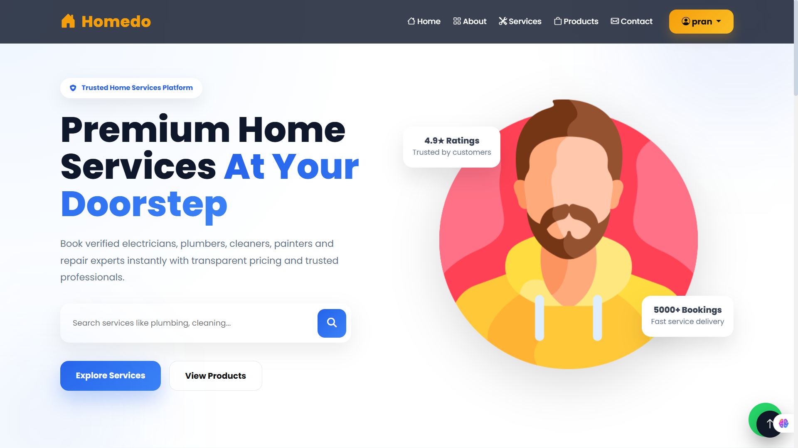
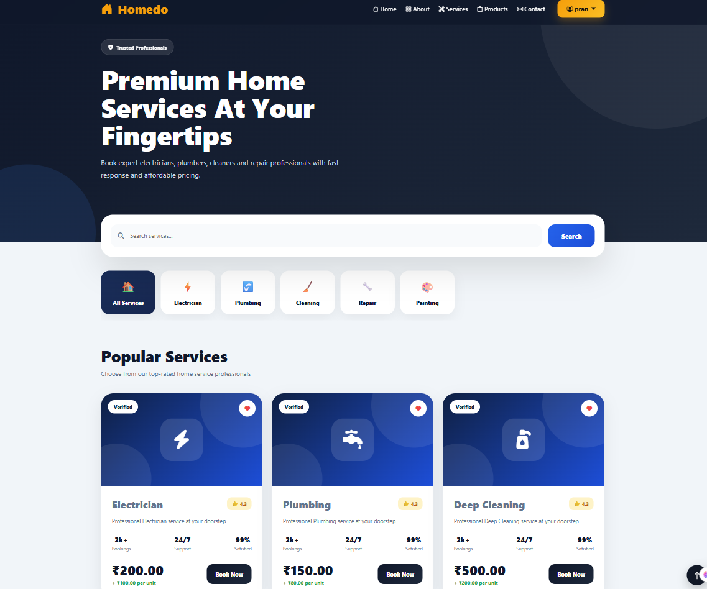
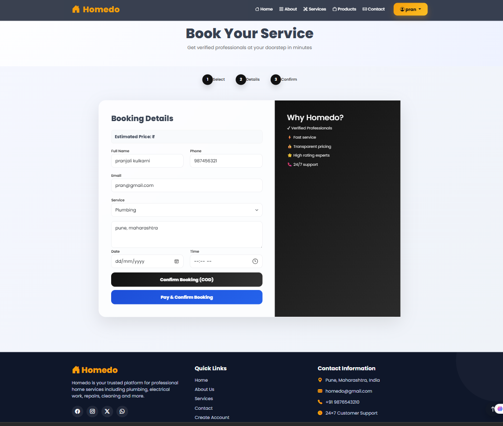
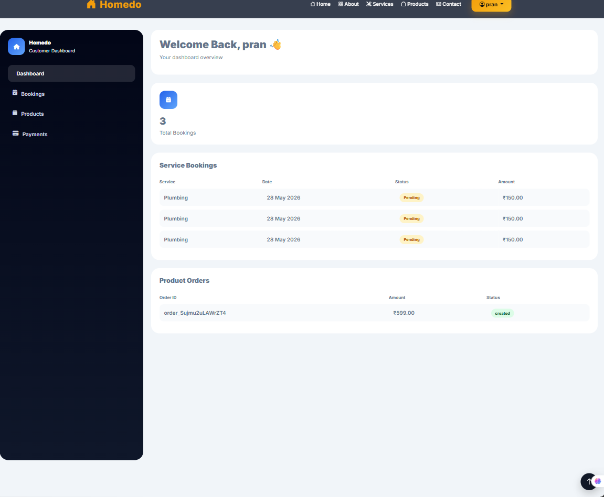
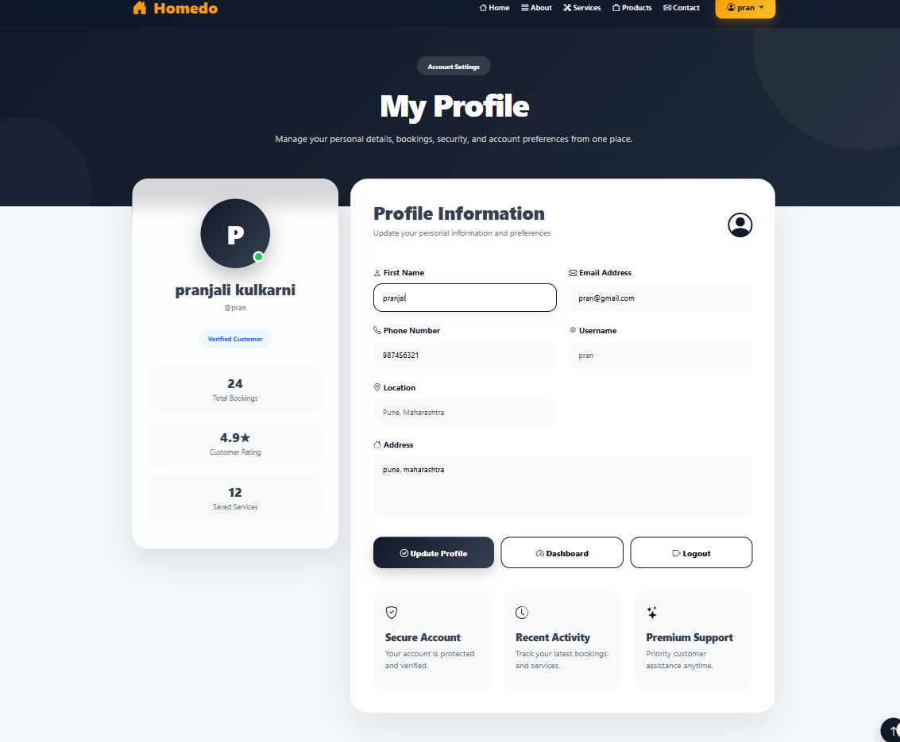
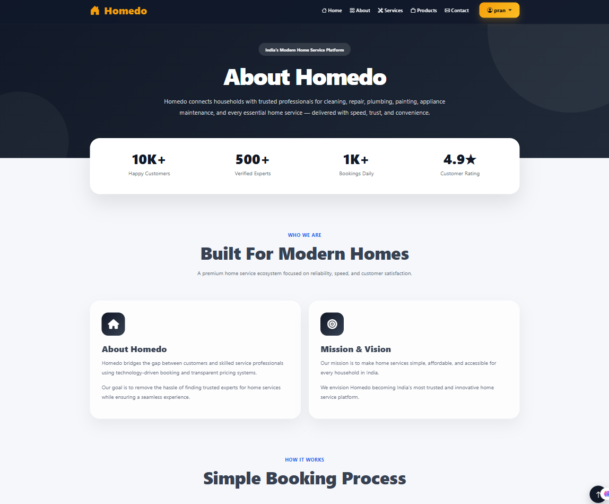
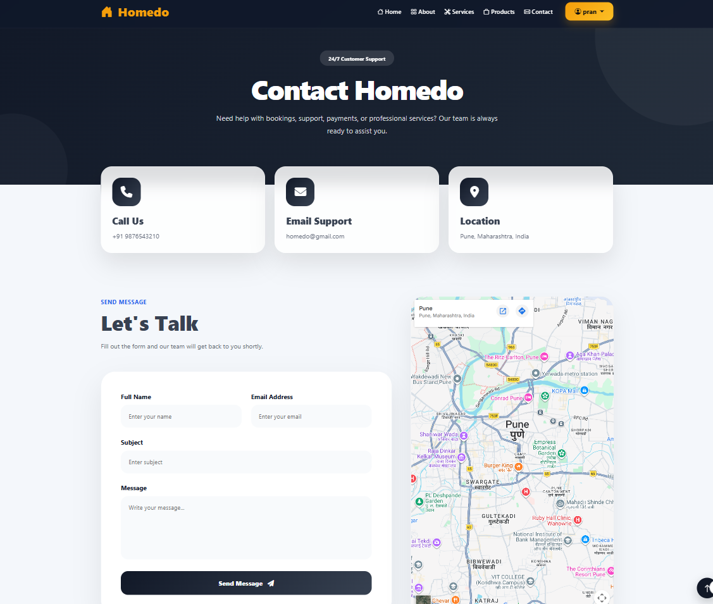

# Homedo – Household Services Management System

## Overview

Homedo is a web-based Household Services Management System developed using Django and SQLite. The platform enables users to book household services such as plumbing, electrical repairs, cleaning, and other home maintenance services through an intuitive online interface.

The system provides separate dashboards for customers, service providers, and administrators, ensuring efficient service management, booking tracking, and payment processing.

---

## Key Features

### Customer Module

* User Registration and Authentication
* Browse Available Services
* Book Household Services
* Track Booking Status
* Online Payment Integration
* Order History Management
* Profile Management

### Service Provider Module

* Service Provider Login
* View Service Requests
* Accept or Reject Bookings
* Manage Assigned Tasks
* Track Service Status

### Administrator Module

* User Management
* Service Category Management
* Booking Management
* Provider Management
* Payment Monitoring
* System Administration Dashboard

---

## Technology Stack

| Component         | Technology                         |
| ----------------- | ---------------------------------- |
| Backend           | Python, Django                     |
| Frontend          | HTML5, CSS3, Bootstrap, JavaScript |
| Database          | SQLite                             |
| Payment Gateway   | Razorpay                           |
| Development Tools | VS Code, Git, GitHub               |

---

## System Architecture

```text
Customer
    │
    ▼
Browse Services
    │
    ▼
Book Service
    │
    ▼
Service Provider
(Accept / Reject)
    │
    ▼
Payment Processing
    │
    ▼
Booking Completion
    │
    ▼
Booking History
```

---

## Modules

| Module             | Description                          |
| ------------------ | ------------------------------------ |
| Authentication     | Secure login and registration system |
| Customer Dashboard | Booking and profile management       |
| Provider Dashboard | Service request handling             |
| Booking Management | Service booking workflow             |
| Payment System     | Razorpay and Cash on Delivery        |
| Product Management | Product ordering functionality       |
| Admin Panel        | Complete system administration       |

---

## Payment System

The application supports multiple payment methods:

* Razorpay Online Payments
* Cash on Delivery (COD)

Features include:

* Secure Payment Processing
* Payment Verification
* Transaction Tracking
* Booking Confirmation

---

## Installation Guide

### Clone Repository

```bash
git clone https://github.com/Harshali-14/Django-household-service-booking-system.git

cdDjango-household-service-booking-system
```

### Create Virtual Environment

```bash
python -m venv venv
```

### Activate Virtual Environment

**Windows**

```bash
venv\Scripts\activate
```

**Linux / macOS**

```bash
source venv/bin/activate
```

### Install Dependencies

```bash
pip install -r requirements.txt
```

### Apply Database Migrations

```bash
python manage.py makemigrations
python manage.py migrate
```

### Create Admin User

```bash
python manage.py createsuperuser
```

### Run Development Server

```bash
python manage.py runserver
```

Open the application in your browser:

```text
http://127.0.0.1:8000/
```

---

## Project Screenshots

### Home Page



### Services Page



### Booking Page



### Dashboard



### Profile Page



### Products Page


### About Page



### Contact Page



---

## Security Features

* Django Authentication System
* Password Hashing
* CSRF Protection
* Session Management
* Secure Payment Verification

---

## Future Enhancements

* Mobile Application
* Real-Time Chat Support
* AI-Based Service Recommendations
* Email Notifications
* SMS Notifications
* Analytics Dashboard
* Service Provider Ratings and Reviews

---

## Project Status

**Status:** Completed

This project was developed as part of MCA academic work and practical learning in Django web development.

---

## Developer

**Harshali Kulkarni**
MCA Student
Python Developer | Django Developer

---

## License

This project is intended for educational and learning purposes.
